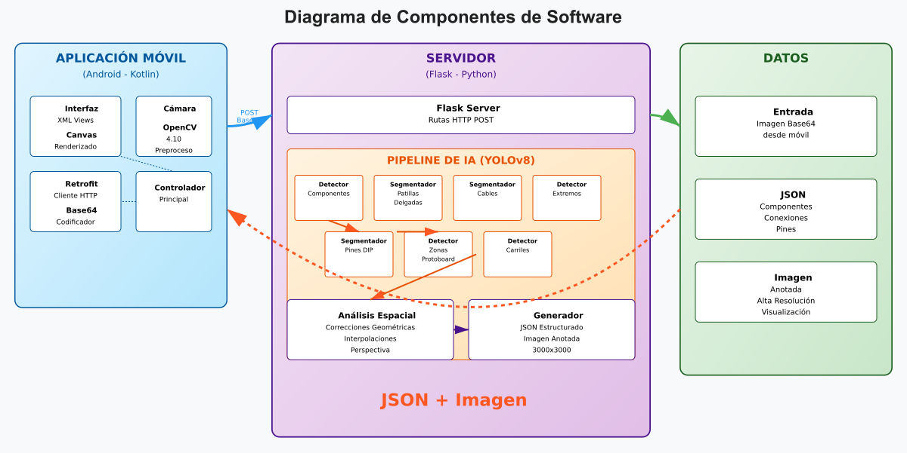

## Autor
**Nombre**: Calderón Flores Enrique Antonio  
**Carrera**: Ingeniería en Ciencias de la Computación  
**Materia**: SIS330 - Sistemas Inteligentes  
**Universidad**: Universidad Mayor, Real y Pontificia de San Francisco Xavier de Chuquisaca

---

# Software De Generación De Esquemáticos Eléctricos A Partir De Imágenes De Circuitos Montados En Protoboard

## Propósito y Beneficios

Este proyecto ofrece un sistema inteligente para generar esquemas eléctricos de circuitos armados completamente en una sola protoboard, utilizando visión por computadora y aprendizaje profundo. Dirigido a estudiantes y entusiastas de la electrónica, analiza imágenes de protoboards reales para identificar componentes y conexiones, produciendo un esquema eléctrico visual que permite a los usuarios verificar manualmente el montaje. Es ideal para cursos introductorios, prácticas de laboratorio y proyectos educativos sin soldadura.

**Beneficios**:

- **Generación de Esquemas**: Crea esquemas eléctricos precisos para facilitar la verificación manual.
- **Ahorro de Tiempo y Costos**: Reduce errores de montaje, evitando daños a componentes y protoboards.
- **Apoyo Educativo**: Ofrece retroalimentación visual para principiantes, mejorando el aprendizaje práctico y la confianza.

## Cómo Funciona

El sistema combina una aplicación móvil (cliente) y un servidor en una PC para procesar imágenes de protoboards y generar esquemas eléctricos. La aplicación captura imágenes, permite seleccionar tipos de circuitos integrados (DIPs) si se detectan, y muestra el esquema resultante. El servidor ejecuta modelos de inteligencia artificial para analizar la imagen y devolver los resultados.

### Modelos de Procesamiento

El procesamiento se basa en un pipeline modular que utiliza la arquitectura YOLOv8 para detección de objetos y segmentación por instancias, dividido en ocho etapas:

1. **Detección de Componentes**: Identifica componentes electrónicos en el protoboard mediante cajas delimitadoras para un análisis detallado.
2. **Segmentación de Patillas Finas**: Detecta las patillas de componentes pequeños (por ejemplo, resistencias, LEDs) para mapear conexiones con precisión.
3. **Segmentación de Cables**: Segmenta cables individuales, trazando sus trayectorias incluso si se superponen, para reconstruir el esquema de conexiones.
4. **Detección de Extremos de Cables**: Localiza los extremos de los cables con cajas delimitadoras para vincularlos correctamente con otros componentes.
5. **Segmentación de Pines (DIPs/Sensores)**: Detecta pines de componentes complejos como circuitos integrados con alta precisión, considerando su orientación.
6. **Detección de Zonas Clave**: Identifica los carriles de alimentación y la división central del protoboard para delimitar el área de trabajo.
7. **Detección de Carriles**: Detecta carriles verticales del protoboard con cajas delimitadoras, conectando componentes dentro del mismo carril.
8. **Correcciones Espaciales y Geométricas**: Refina las detecciones usando análisis espacial, interpolando pines faltantes en circuitos integrados, corrigiendo distorsiones de perspectiva (por ejemplo, en botones) y verificando conexiones mediante superposición geométrica. Esto asegura una reconstrucción robusta del esquema eléctrico, incluso con interrupciones visuales.

### Tecnologías

- **Aplicación Móvil (Cliente)**:
  - **Entorno**: Desarrollada en Android Studio con Kotlin 1.9.24.
  - **Interfaz**: Vistas XML para captura de imágenes, visualización de resultados y selección de tipos de DIPs (por ejemplo, 7408) cuando se detectan, ya que las inscripciones en los DIPs pueden ser poco claras o estar obstruidas por cables.
  - **Captura y Preprocesamiento**: Usa OpenCV 4.10 para capturar y redimensionar imágenes, codificándolas en Base64.
  - **Comunicación**: Emplea Retrofit para enviar solicitudes HTTP POST al servidor y recibir respuestas en JSON e imágenes procesadas.
  - **Visualización**: Renderiza el esquema eléctrico con Canvas, mostrando componentes, conexiones y carriles con colores distintivos.
- **Servidor (Backend)**:
  - **Entorno**: Implementado en Python con Flask, desplegado en Ubuntu.
  - **Procesamiento**: Ejecuta el pipeline de modelos YOLOv8 y análisis espacial para generar un JSON con datos del circuito y una imagen anotada (3000x3000).
  - **Rutas HTTP**: Recibe imágenes Base64 vía POST y devuelve resultados procesados.

El sistema genera una imagen de alta resolución (3000x3000) en la aplicación móvil, mostrando componentes, conexiones y zonas clave, permitiendo a los usuarios verificar el circuito contra el esquema eléctrico generado.

## Cómo Instalar

### Requisitos

- **Aplicación Móvil**:
  - Dispositivo Android (versión 8.0 o superior).
  - Android Studio con Kotlin 1.9.24.
  - Dependencias principales: OpenCV 4.10, Retrofit.
- **Servidor**:
  - PC con Ubuntu (o compatible con Python 3.8+).
  - Dependencias principales: Flask, YOLOv8.

### Instrucciones

El repositorio cuenta con ambas partes del proyecto, el codigo fuente de la aplicación móvil y el código fuente del servidor.
Por tanto, al clonar el repositorio se tiene a disposición ambas partes.

1. **Configurar el Servidor**:
   - EL servidor se encuentra en la carpeta "circuitsDetectionServerEACF" del repositorio 
   - Instala dependencias: `pip install -r requirements.txt`.
   - Inicia el servidor Flask: `python app.py`. 
   - Asegúrate de que el servidor esté accesible en la red local (por ejemplo, `http://<IP_LOCAL>:5000`).
2. **Configurar la Aplicación Móvil**:
   - El código de la aplicación movil se encuentra en la carpeta "schemaitics" del repositorio.
   - Abre el proyecto en Android Studio.
   - Para configurar la conexión con el servidor, edite el archivo Constants.kt para especificar la dirección IP del servidor al que apunta la aplicación. Asegúrese de que esta IP coincida con la configurada en el archivo network_security_config.xml, ubicado en app/src/main/res/xml/, donde se definen los permisos de red de Android para permitir la comunicación con el servidor. Actualice ambos archivos con la misma IP para garantizar una conexión segura y correcta.
   - Instala las dependencias (Retrofit) mediante Gradle.
   - Para integrar OpenCV en el proyecto, descargue la biblioteca desde su repositorio oficial para Android Studio. Importe el módulo de OpenCV al proyecto y asegúrese de que las versiones especificadas en los archivos build.gradle (nivel de proyecto y nivel de módulo) sean idénticas para evitar errores de compilación. Sincronice el proyecto tras realizar los cambios.
   - Compila e instala la aplicación en un dispositivo Android.
3. **Uso**:
   - Abra la aplicación móvil y capture una imagen de un protoboard con un circuito completo.
   - La imagen se envía al servidor, que procesa la solicitud y devuelve una respuesta a la aplicación.
   - Si se detectan circuitos integrados (DIPs), seleccione el tipo correspondiente (por ejemplo, 7408) en los desplegables generados por la aplicación. En caso de múltiples DIPs, cada uno se identifica con un color distintivo para asociarlo correctamente con su desplegable.
   - La selección se envía al servidor, que genera un archivo JSON con la información del circuito y lo devuelve a la aplicación móvil.
   - La aplicación utiliza el JSON recibido para renderizar el esquema eléctrico en Canvas, mostrando componentes, conexiones y carriles.
   - Visualice el esquema eléctrico generado en la aplicación para verificar el montaje del circuito.

**Nota**: Asegúrate de que el dispositivo móvil y el servidor estén en la misma red para la comunicación.